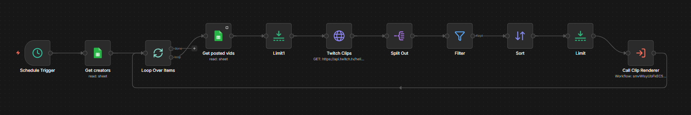
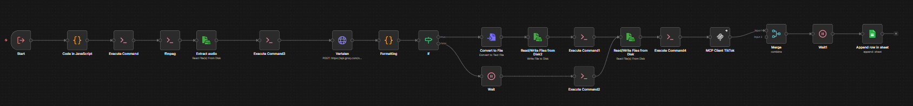

# 🤖 VideoMachine: Automated Content Engine

Een krachtige, end-to-end automatisering ontwikkeld in n8n om het proces van content-creatie volledig te digitaliseren. Dit project scant, downloadt en rendert Twitch-clips naar kant-en-klare video-content zonder enige handmatige tussenkomst.

## 🌟 Belangrijkste Features
- **Twitch Clip Discovery:** Automatische monitoring van specifieke kanalen voor de nieuwste 'trending' clips via directe API-integraties.
- **High-Performance Rendering:** Server-side video-editing (schalen, knippen en filteren) met een geïntegreerde FFmpeg-engine.
- **Slimme Media-Extractie:** Implementatie van `yt-dlp` binnen een Docker-omgeving voor razendsnelle en betrouwbare downloads.
- **Modulaire Architectuur:** Slim gebruik van sub-workflows (zoals de 'Clip Renderer') voor een overzichtelijke en schaalbare logic-flow.
- **Self-Healing Logic:** Uitgebreide foutrapportage en automatische retry-mechanismen bij API-onderbrekingen of netwerkfouten.

## 🛠️ Tech Stack
- **Platform:** [n8n](https://n8n.io/) (Self-hosted v1.x)
- **Video Processing:** FFmpeg (Command-line toolset)
- **Scraping & Automation:** Python 3 & yt-dlp
- **Containerization:** Docker & Portainer (Debian-based images)
- **Infrastructuur:** Proxmox VE - Gedraaid op een dedicated HP node (Server-grade hardware)
- **Networking:** Nginx Proxy Manager (SSL & Websocket tunneling)

## 📈 Impact
De 'VideoMachine' elimineert de traditionele 'bottleneck' van handmatige video-editing. Dit resulteert in een volledig autonome content-pijplijn:
- **100% Tijdsbesparing:** Het volledige proces van ontdekken tot renderen gebeurt op de achtergrond.
- **Consistente Content-Flow:** Altijd een constante stroom aan verse clips beschikbaar voor social media kanalen.
- **Onbeperkte Schaalbaarheid:** De modulaire opzet maakt het eenvoudig om uit te breiden naar platformen als YouTube Shorts, TikTok of Instagram Reels.

## 📸 Preview
### Main flow

### Sub flow

---
*Ontwikkeld door Tijn - 2026*
